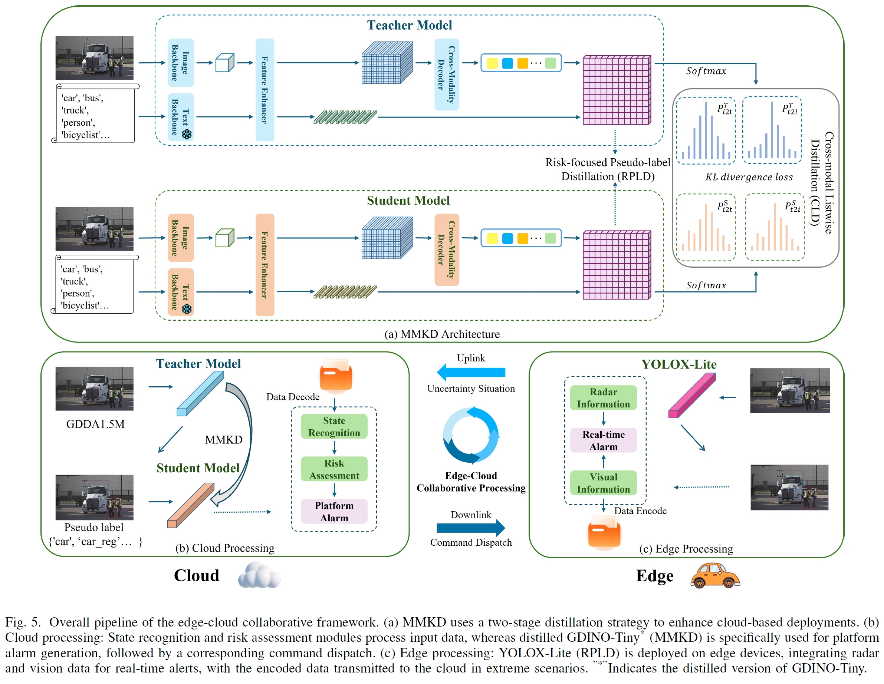
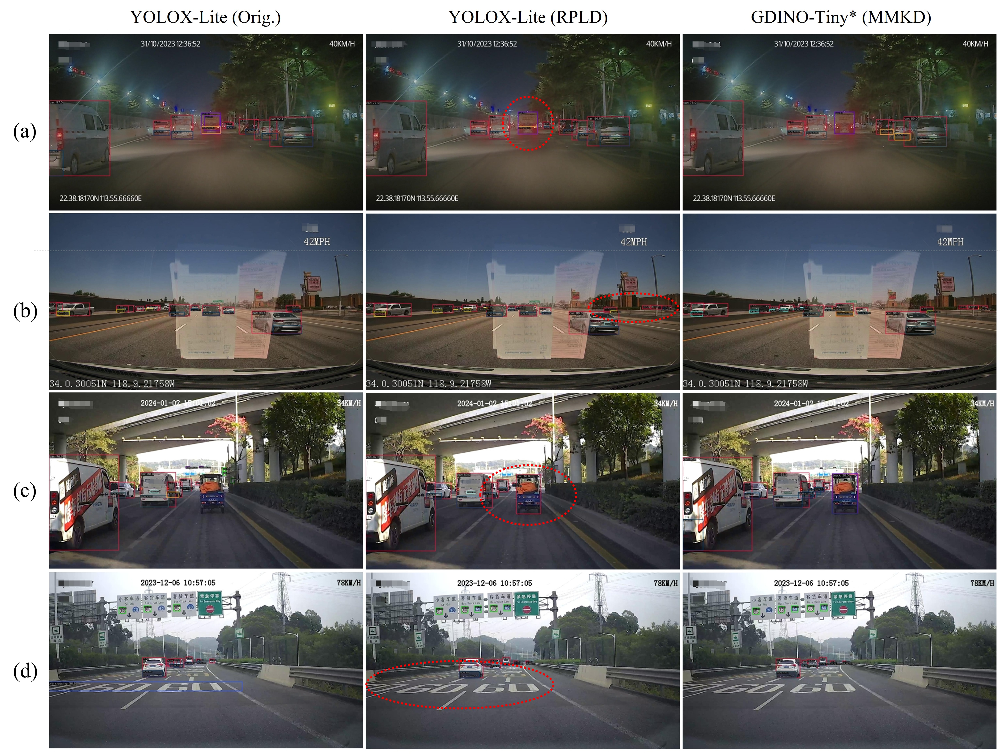

# Distilling Grounding DINO for an Edge-Cloud Collaborative Advanced Driver Assistance System

[**Paper**](https://github.com/HuAndrew/mmkd) | [**Project Page**](https://huandrew.github.io/mmkd.io/) 

------

## 🧠 Introduction

This repository contains the official PyTorch implementation of our paper:

> **Distilling Grounding DINO for an Edge-Cloud Collaborative Advanced Driver Assistance System**

Abstract
> Grounding DINO (GDINO) has strong potential for use in zero-shot detection and data annotation, but its use is limited by high computational costs. In addition, YOLOX allows real-time detection but struggles to perform well in complex scenes. To address this challenge, we propose an edge-cloud collaborative framework for an Advanced Driver Assistance System (ADAS) to enhance real-time detector performance on edge devices by leveraging the robust capabilities of cloud-based multimodal detectors to improve perception in complex environments. Our framework consists of cloud and edge components: on the cloud side, we propose a distillation method for multimodal object detectors, which is referred to as **MMKD**, to optimize the performance of `GDINO`. Specifically, we use a two-stage distillation strategy, including Cross-modal Listwise Distillation (**CLD**) and Risk-focused Pseudo-label Distillation (**RPLD**). With MMKD, we successfully deploy the `GDINO` model to the cloud, achieving a 1.4% improvement in average precision (AP) and a **1.7×** increase in inference speed. On the edge side, leveraging this streamlined version of `GDINO`, we propose an ADAS data engine to construct a 1.5 Million-scale GDINO-based Dataset for ADAS, named `GDDA1.5M`. Impressively, on the basis of YOLOX-Lite, we develop a lightweight object detector that is optimized for the application of an ADAS on edge devices through pruning and architectural refinements. Leveraging the `GDDA1.5M` dataset and the **RPLD** training strategy, the model achieves a **7.5%** improvement in AP, substantially surpassing its counterparts that were trained on 300K manually labeled images. After the YOLOX-Lite detector is deployed on edge devices within our proposed edge-cloud collaborative framework, it achieves an inference speed of **18 milliseconds** on the Horizon X3E chip, while the cloud-based distilled model functions efficiently in complex environments.


In this work, we address three key challenges in deploying large-scale multimodal detectors in ADAS:

1. **MMKD**: We introduce `MMKD`, a novel distillation method for large-scale multimodal object detection models, which reduces computational costs and enhances application performance.

2. **GDDA1.5M**: We develop `GDDA1.5M`, a large-scale dataset generated via our data engine, which significantly enhances the diversity and representativeness of driving scenarios for comprehensive ADAS training and evaluation.

3. **Edge-Cloud Collaboration**: We propose a novel edge-cloud collaborative framework that fully leverages the strengths of both edge computing and cloud computing to handle more complex scenarios in a cooperative manner. This framework ensures a rapid response to urgent hazards with only 18 ms latency on the edge side, whereas the distilled model on the cloud side processes complex tasks in extreme scenarios to provide comprehensive analyses and robust decision-making capabilities.


------


## 🔍 Main Results

### 📊 Comparison with Other Distillation Methods on GDDA1.5M-TrainGT

> (T: teacher; S: student)

|     **Model**      |     **AP**      | **AP<sub>S</sub>** | **AP<sub>M</sub>** | **AP<sub>L</sub>** |
| :----------------: | :-------------: | :----------------: | :----------------: | :----------------: |
|     DINO-Large     |      58.3       |        23.2        |        53.7        |        68.2        |
| **T: GDINO-Large** |      61.1       |        26.0        |        57.1        |        73.0        |
| **S: GDINO-Tiny**  |      58.1       |        22.6        |        53.2        |        69.6        |
|        FGD         |   57.8 (0.3↓)   |        22.3        |        52.9        |        69.3        |
|        PKD         |   56.3 (1.8↓)   |        21.7        |        52.4        |        68.3        |
|        CWD         |   56.1 (2.0↓)   |        21.3        |        52.1        |        67.2        |
|       FreeKD       |   57.6 (0.5↓)   |        22.1        |        52.8        |        68.9        |
|        AFD         |   57.2 (0.9↓)   |        21.8        |        52.3        |        68.2        |
|        ICL         |   58.3 (0.2↑)   |        22.9        |        53.7        |        70.1        |
|   **CLD (Ours)**   | **58.9 (0.8↑)** |      **23.7**      |      **54.4**      |      **71.7**      |

------

### 🧪 Distillation Results on SODA10M Dataset

> "Params." = model parameters (in millions); "Mem." = peak GPU memory usage (batch size = 1)

|   **Model**    | **Params ↓ (M)** | **Mem ↓ (GB)** |  **AP**  | **APS**  | **APM**  | **APL**  |
| :------------: | :--------------: | :------------: | :------: | :------: | :------: | :------: |
| T: GDINO-Large |       341        |      5.44      |   55.9   |   34.0   |   51.0   |   69.6   |
| S: GDINO-Tiny  |       172        |      2.23      |   52.3   |   29.1   |   47.3   |   66.4   |
| **CLD (Ours)** |     **172**      |    **2.23**    | **52.8** | **29.9** | **47.8** | **67.5** |


### 🎯 Visualization

#### GDDA1.5M
<p>
The examples in follow figure highlight the diversity of the dataset across various challenging scenarios, including different geographic locations, weather conditions, and times of day. By leveraging these diverse sources, `GDDA1.5M` provides a comprehensive foundation for training and refining autonomous driving models, enhancing their ability to handle complex real-world driving conditions.
</p>


#### RPLD

> **Note**: *YOLOX-Lite (Orig.)* denotes the baseline model without distillation. *YOLOX-Lite (RPLD)* and *GDINO-Tiny\* (MMKD)* are student models optimized through distillation.
>  Red dashed boxes highlight regions where detection is improved by distillation, particularly under challenging conditions.


<p>
We present detailed visualization results to analyze the perceptual differences across various ADAS scenarios:
</p>

- **Scene (a)**: Focuses on general perception performance. The distilled YOLOX-Lite (via `GDDA1.5M`) reduces jitter and enhances tracking stability compared to the original baseline. Its detection results are visually consistent with those of the larger teacher model (`GDINO-Tiny*`).
- **Scene (b)**: Highlights long-range perception in North American environments. The original model struggles with detecting unconventional vehicles at medium-to-long distances. The distilled` YOLOX-Lite` shows significantly improved localization and reduced instability, aligning closely with the performance of `GDINO-Tiny*`.
- **Scene (c)**: In scenarios with missed detections, the distilled model recovers some of the missed targets. However, category confusion—such as misclassification between tricycles, cars, and riders—remains a challenge for both the student and teacher models.
- **Scene (d)**: Demonstrates the reduction of false positives. The distilled YOLOX-Lite successfully suppresses irrelevant detections, such as ground arrows, speed limit indicators, textual signs, and lane markings—enhancing real-world deployment reliability.

------

## 🚀 Quick Start

### 🔧 Environment Setup

MMKD uses the same environment and dataset format as [MM-Grounding-DINO](https://github.com/open-mmlab/mmdetection/blob/main/configs/mm_grounding_dino/dataset_prepare.md). We recommend using [MMDetection](https://github.com/open-mmlab/mmdetection) v3.2+.

```bash
conda create --name openmmlab python=3.8 -y
conda activate openmmlab

# Clone MMDetection
git clone https://github.com/open-mmlab/mmdetection.git
cd mmdetection
pip install -r requirements/mminstall.txt
pip install -v -e .

# Additional dependencies
cd {REPS_ROOT}/MMKD
pip install -r requirements.txt  # Provided in this repo
```

------

### 📁 Project Structure

```bash
.
+--- CIPO                                           # CIPO processing
|   +--- CIPO.py
+--- Exps                                           # Experiment results
|   +--- Cloud side
|   |   +--- Student AP.png
|   |   +--- Teacher AP.png
|   +--- Edge side
|   |   +--- 300K_manually_annotatedGDDA1.5M.png
|   |   +--- 300K_Pseudo_label_GDDA1.5M.png
|   |   +--- Full-scale_dataGDDA1.5M.png
+--- MMKD
|   +--- configs                                    # Training/test configs
|   |   +--- mm_grounding_dino
|   |   |   +--- MMKD.py
|   |   +--- models
|   |   |   +--- backbones
|   |   |   +--- detectors
|   |   |   |   +--- grounding_dino.py
|   |   |   |   +--- MMKD.py
|   |   |   |   +--- yolox.py
|   |   |   |   +--- __init__.py
|   +--- tools
|   |   +--- train.py                               # Main entry point
+--- README.md                                      # Project documentation            
                   
```

------

### 📦 Dataset Preparation

To reproduce the experiments in `MMKD`, please refer to the official dataset and environment setup of [MM-Grounding-DINO](https://github.com/open-mmlab/mmdetection/blob/main/configs/mm_grounding_dino/dataset_prepare.md). `MMKD `shares the same environment and dataset configuration as MM-Grounding-DINO. We recommend using [MMDetection](https://github.com/open-mmlab/mmdetection) (v3.0 or above) as the base framework. 

All annotation files should be in COCO-style format.

------

## 🤝 Acknowledgements

This project is built upon the excellent work of:

- [MM-Grounding-DINO](https://github.com/open-mmlab/mmdetection/tree/main/configs/mm_grounding_dino)
- [MMDetection](https://github.com/open-mmlab/mmdetection)

------

